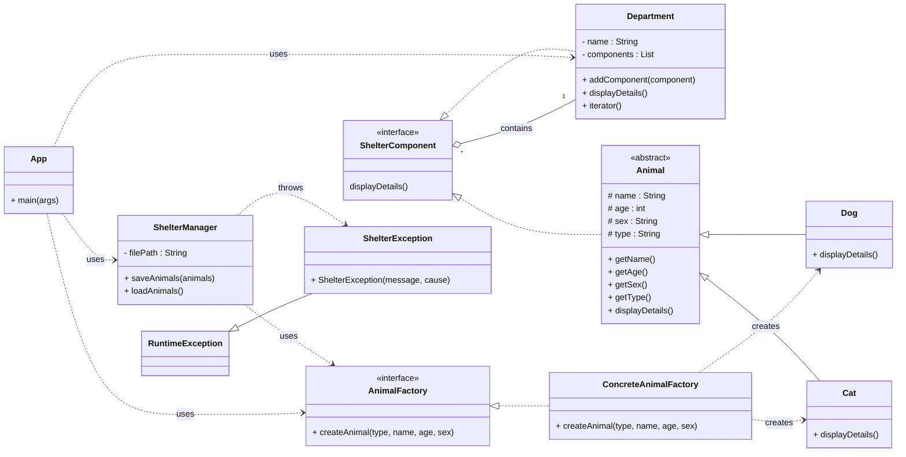

# Progetto OOP: Gestione Rifugio Animali

## 1. Panoramica dell'Applicazione

Questo progetto è un'applicazione Java SE per la gestione di un rifugio di animali. È un'applicazione a riga di comando che dimostra l'uso dei principi di programmazione orientata agli oggetti, design pattern e tecnologie fondamentali di Java.

Le funzionalità principali includono:
* Creazione di diversi tipi di animali (cani e gatti) tramite una factory.
* Organizzazione degli animali in una struttura gerarchica di reparti.
* Salvataggio dello stato del rifugio su un file JSON per la persistenza dei dati.
* Caricamento dello stato del rifugio da un file JSON all'avvio.
* Logging strutturato per monitorare le operazioni dell'applicazione.

---

## 2. Tecnologie e Pattern Utilizzati

Questo progetto utilizza una serie di tecnologie e design pattern per soddisfare i requisiti della richiesta d'esame.

### Design Pattern 

* **Factory Pattern**: Utilizzato per la creazione degli oggetti `Animal`. La `AnimalFactory` definisce un'interfaccia per creare animali, mentre `ConcreteAnimalFactory` fornisce l'implementazione concreta. Questa scelta è stata fatta per **separare la logica di creazione degli oggetti dal client** (`App.java`). In questo modo, il client non ha bisogno di conoscere i dettagli costruttivi di `Dog` o `Cat`, e diventa facile aggiungere nuovi tipi di animali in futuro senza modificare il client.
* **Composite Pattern**: Utilizzato per creare una struttura gerarchica (ad albero) del rifugio. L'interfaccia ShelterComponent rappresenta sia gli elementi singoli (Animal) sia i contenitori (Department). Questo pattern permette di trattare un singolo animale e un intero reparto in modo uniforme, semplificando operazioni come la visualizzazione dei dettagli dell'intera struttura del rifugio con una singola chiamata ricorsiva.
* **Iterator Pattern**: Implementato nella classe `Department` facendola ereditare da `Iterable<ShelterComponent>`. Questo pattern fornisce un modo standard per **accedere sequenzialmente agli elementi di una collezione complessa** (lista di componenti) senza esporne la rappresentazione interna. Permette l'uso del ciclo for-each, rendendo il codice più leggibile e pulito.
* **Exception Shielding**: Implementato nel metodo `loadAnimals()` della classe `ShelterManager`. Le eccezioni di basso livello e specifiche (es. `IOException`, `JSONException`) vengono catturate, loggate internamente, e viene lanciata una nuova eccezione più generica e sicura (`ShelterException`). Questo **impedisce che dettagli sensibili sull'implementazione (es. struttura del file system, librerie usate) vengano esposti al client** in caso di errore, rispettando il principio di programmazione sicura.

### Tecnologie Fondamentali

* **Java 11**: Il progetto è basato su Java 11.
* **Maven**: Utilizzato come build tool per la gestione delle dipendenze (JUnit, SLF4J, JSON), la compilazione del progetto e la creazione di un JAR eseguibile.
* **Collections & Generics**: `List<Animal>` e `List<ShelterComponent>` sono usate per gestire le collezioni di oggetti in modo sicuro e flessibile.
* **Java I/O (NIO)**: `ShelterManager` utilizza il package `java.nio.file` per leggere e scrivere il file JSON. Questa API moderna è più performante e robusta rispetto al vecchio `java.io`.
* **Logging (SLF4J & Logback)**: È stato implementato un sistema di logging professionale per tracciare gli eventi dell'applicazione, come l'avvio, il salvataggio dei dati e gli errori, come richiesto dalla traccia d'esame.
* **JUnit 5**: Il progetto include una suite di test unitari per validare la logica delle classi `AnimalFactory` e `ShelterManager`, garantendo l'affidabilità del codice.

---

## 3. Istruzioni per l'Installazione e l'Esecuzione

### Prerequisiti
* Java Development Kit (JDK) 11 o superiore.
  > Assicurarsi che la variabile d'ambiente `JAVA_HOME` sia impostata correttamente.
* Apache Maven.

### Compilazione ed Esecuzione
1.  **Clonare il repository** (o scaricare i file in una cartella).
2.  **Aprire un terminale** nella cartella principale del progetto (dove si trova il file `pom.xml`).
3.  **Compilare il progetto e creare il JAR eseguibile** con il seguente comando Maven:
    ```bash
    mvn clean package
    ```
    Questo comando pulirà le build precedenti, compilerà il codice, eseguirà i test e creerà un file JAR con tutte le dipendenze nella cartella `target/`.
4.  **Eseguire l'applicazione** con il seguente comando:
    ```bash
    java -jar target/RifugioAnimali-1.0-SNAPSHOT-jar-with-dependencies.jar
    ```
    L'applicazione si avvierà, creerà un file `animals.json` nella cartella principale, e stamperà in console la struttura del rifugio.

---

## 4. Diagramma delle Classi UML



---

## 5. Limitazioni e Lavori Futuri

### Limitazioni Attuali
* L'applicazione non ha un'interfaccia utente interattiva (CLI), ma esegue solo uno script predefinito.
* La persistenza dei dati è limitata a un singolo file JSON locale. Non c'è un database.
* La gestione degli errori è basilare e si affida al pattern Exception Shielding.

### Miglioramenti Futuri
* **Implementare il Builder Pattern**: Per la creazione di oggetti `Animal` con più attributi opzionali (es. colore, razza, stato di salute), il Builder Pattern renderebbe il codice più leggibile e scalabile.
* **Sviluppare un'Interfaccia a Riga di Comando (CLI)**: Aggiungere la possibilità per l'utente di interagire con l'applicazione per aggiungere, rimuovere o visualizzare animali.
* **Integrare un Database**: Sostituire la persistenza su file JSON con un database (es. SQLite) per una gestione dei dati più robusta.
